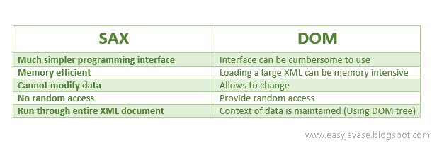

The main difference between SAX (Simple API for XML) and DOM (Document Object Model) lies in how they parse and handle XML documents:
### SAX (Simple API for XML):
* Event-driven: SAX is an event-driven parser. It reads the XML document sequentially and triggers events (like startElement, endElement, characters) as it encounters different parts of the document.
* Memory-efficient: SAX does not load the entire document into memory, making it suitable for parsing large XML files.
* Read-only: SAX is generally used for reading and processing XML data, not for modifying it.
* Forward-only: SAX processes the document in a forward-only manner, meaning you cannot go back to a previous part of the document once it has been processed.

### DOM (Document Object Model):
* Tree-based: DOM loads the entire XML document into memory and represents it as a tree structure of nodes. Each element, attribute, and text in the XML document becomes a node in this tree.
* Memory-intensive: Since DOM loads the entire document into memory, it can be memory-intensive, especially for large XML files.
* Read-write: DOM allows both reading and modifying the XML document. You can navigate, add, remove, or change elements and attributes in the document.
* Random access: DOM allows random access to any part of the document, making it easy to navigate and manipulate the XML structure.

In summary, SAX is more suitable for simple, read-only, and memory-efficient parsing of large XML documents, while DOM is better for applications that require complex manipulation and random access to the XML data.

https://www.javastackflow.com/2014/07/sax-simple-api-for-xml.html

